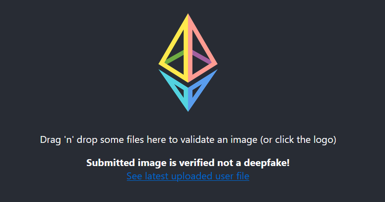

# F22_Certified_Deepfake_Network

<p align="center">
  
</p>

## Setting up the environment for testing
### Dev Setup
Need yarn to run the react application.
```
$ yarn install
```
### Running the web app (default port 3000)
```
$ cd web-app/certified-deepfake-net
$ yarn react-app:start
```
If you encounter, `code: 'ERR_OSSL_EVP_UNSUPPORTED'` on Windows, this was resolved by running the following before starting the app:
```
set NODE_OPTIONS=--openssl-legacy-provider
```

## Local API dev
The model API is hosted on http://deepfake-api-herokuapp.com/

### Install model and API dependencies.
```
$ cd api
$ pip3 install -r requirements.txt
```

### Running the API server locally (default port 8000)
```
$ cd api
$ python3 app.py
```
